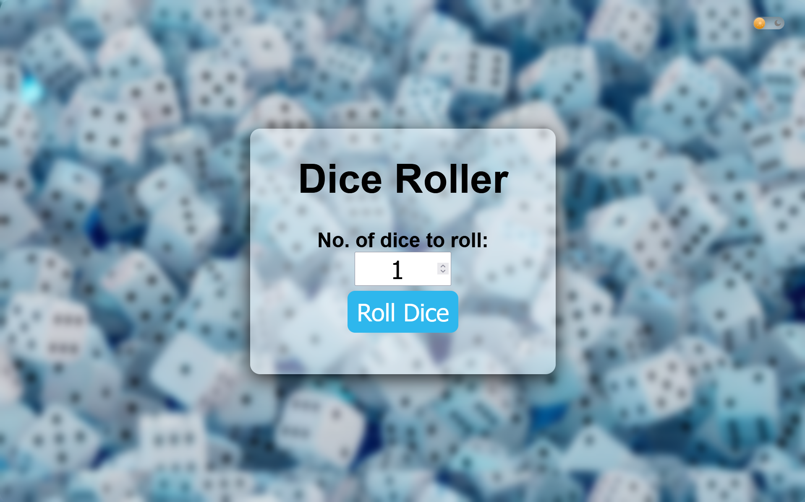
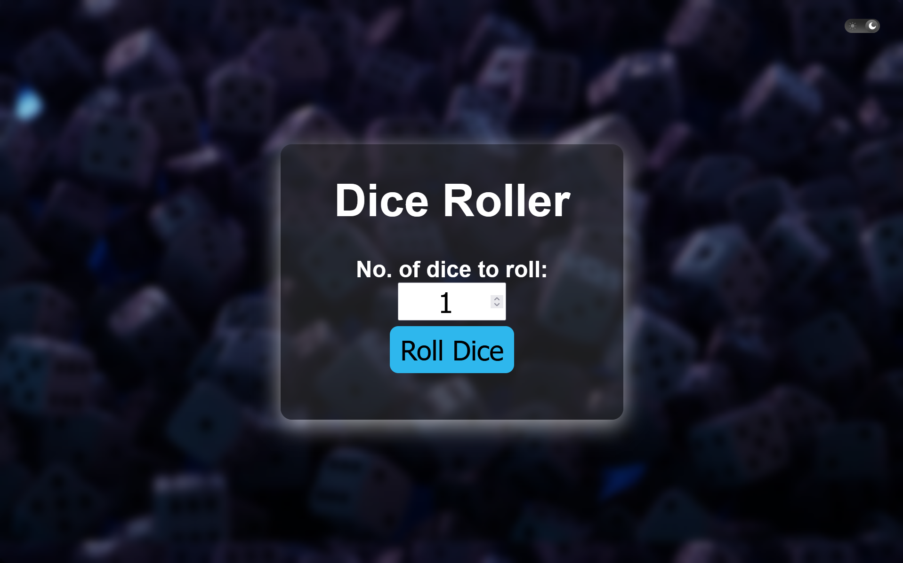

# Simple Dice Roller
What I present here is a simple un-innovative Dice Roller that doesn't really have a usecase. It was made with the purpose of just practicing and adding my own spices to the good old Dice Roller Program.

# Highlights
- Any number of dices can be rolled at a time.
- Also shows images of rolled dice
- Dark/Light theme switcher button

# Image Gallery

# Make your own(You wouldn't want to)

1. Clone this Repository with: `git clone https://github.com/Zyrox-exe/DiceRoller.git`.
2. Open in any modern browser like chrome, firefox etc.
3. Edit the source code as per your liking.
4. Deploy it using a service like github pages/Vercel(or any other).

# Credits
Dice images for no. 2-6 - [Flaticon](https://www.flaticon.com/) 
Dice Image for no. 1 -  [Freeiconspng](https://www.freeiconspng.com/) 
SVGs - [SVGrepo](https://www.svgrepo.com/)

## AI usage
AI was only used to generate the dark mode background image of the lighter version already present on the internet. 
Other than that no AI was used.
<footer>Made by the very great Mohd Sadiq Umar</footer>